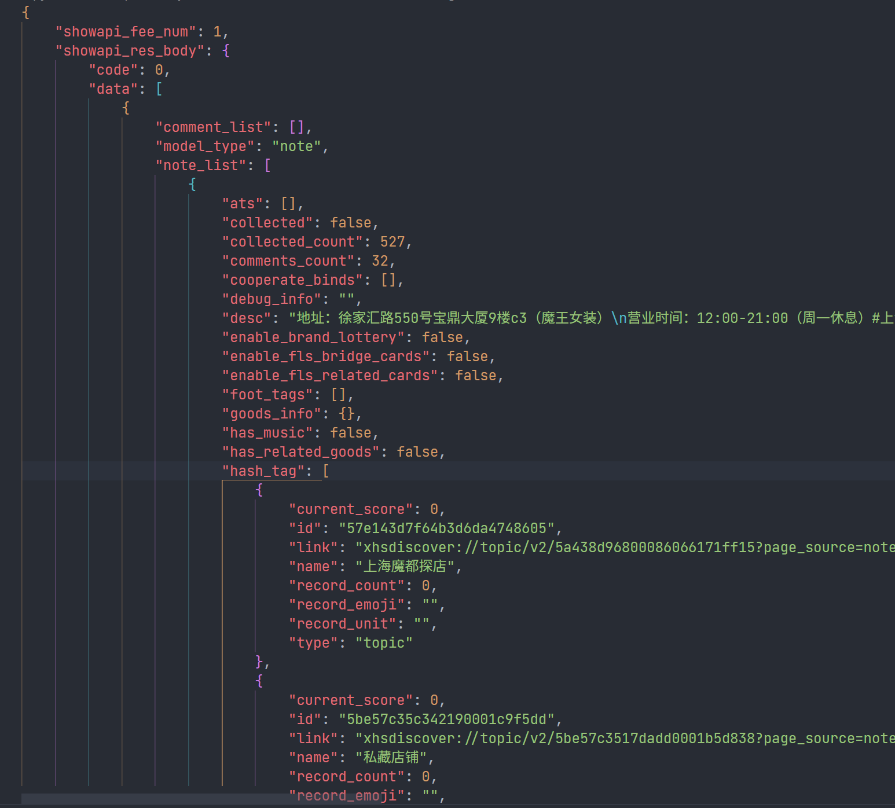
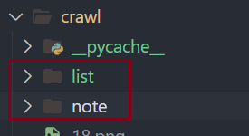

# Environment

python 3.11

# Package
```
pip install request
```

# Test

## Json
test/test_json/data.py是需要进行测试的一个脚本。爬虫爬到的原始数据存储在test/test_json/data.json之中（我已经存储好了），需要测试的是通过这个data.py脚本之后能否转换成可以阅读的tmp.json文件

即在test/test_json文件夹执行：
```
python data.py
```
之后查看tmp.json是否类似于以下：


## Crawl
切记，完成json的测试之后在进行这个测试，因为这个会消耗次数！！！

为了保证开始爬取之后不会出现问题，test/test_crawl/data.py是一个需要测试的脚本, 这个脚本将会执行一次笔记查询的爬取和一次笔记信息的爬取，信息将会保存在test/test_crawl/list.json和test/test_crawl/note.json

所以执行这个脚本的时候一定要仔细考虑！有问题来找我就可以

执行

```
python data.py
```

查询两个json文件是否合法且可阅读

# Run

确保在运行前已经完成了两个测试！！！

脚本将会按照crawl/area.txt之中列出的景点进行爬取，每个景点目前设定为爬取[1, 20)页，每一页爬取到的数据将会保存在crawl/list/result_list_name_page.json之中.

接下来将会爬取每一页返回的数据之中所有的笔记，以以下格式保存在crawl/note/result_note_name_page.json之中

```json
{
    "area-note_id": {note_info},
    "area-note_id": {note_info}
}
```

!!!以下提示请务必做到

首先，在crawl文件夹下创建list和note两个文件夹



接下来

## 如果你是赵晗瑜，请将18行的注释去掉，如下


## 如果你是陈子涵，请将19行的注释去掉，如下


在crawl文件夹下执行

```
python crawl.py
```

即可

出现错误时将会记录在crawl/log.txt之中

# Data

因为api的限制，我们需要首先根据关键字查询一些笔记的列表，之后根据笔记的id获取到笔记的详细内容。这些内容我已经写好
要注意的是执行过程中切勿暂停！！！否则可能会出现数据不连贯的问题